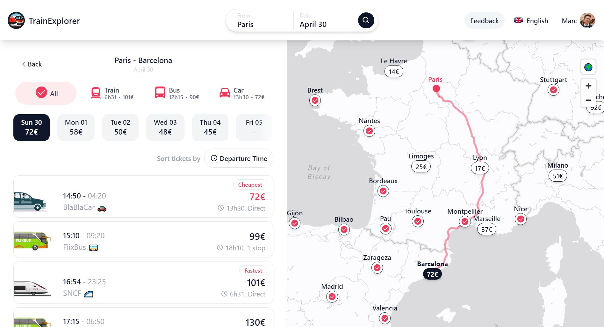
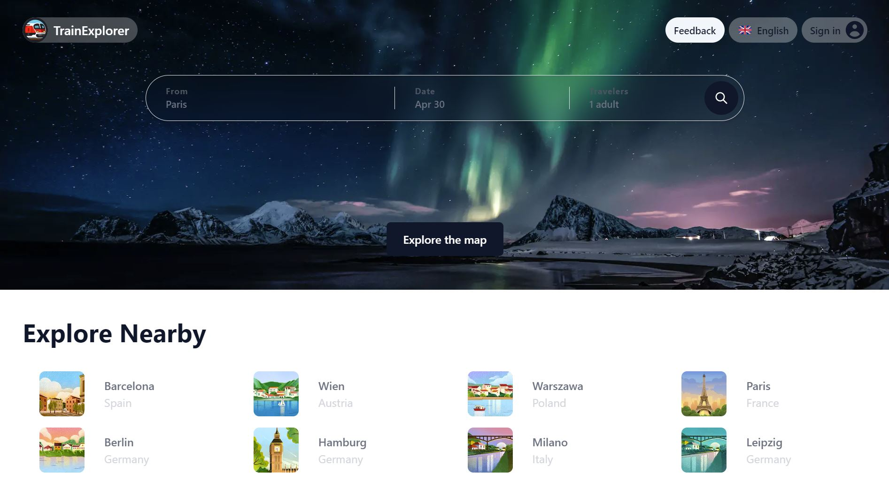

<head>
  <link rel="stylesheet" type="text/css" href="./styles.css">
</head>

<body>

# Train Travel Planner and Booking Platform for Europe 🚂🌍💻

  
  

This project is a train travel planning and booking platform designed to simplify the process of finding and booking train tickets in Europe. The platform integrates openrail routing data and several APIs, including SNCF, Flixbus, OBB, Mav-start, and BlaBlaCar, to provide users with accurate and up-to-date information on journey options and ticket availability. The platform is developed using **Next.js**, **TailwindCSS**, and **Supabase**, ensuring high performance, scalability, and seamless data storage and management.

## Inspiration 💡

Our project was inspired by several other travel booking and planning platforms, including:

- [Google Flights](https://www.google.com/travel/flights)
- [OU Partir Avec TGV Max](https://oupartiravectgvmax.fr/)
- [Direkt Bahn Guru](https://direkt.bahn.guru/)
- [Chrono Trains](https://www.chronotrains.com/)

We looked at these platforms to identify best practices and features that would help us create a user-friendly and efficient travel planning and booking platform for train travel in Europe.

## Features 🚀

- User-friendly interface for searching and comparing journeys
- Integration with openrail routing data and several APIs for accurate and up-to-date information
- Real-time train tracking and alerts for updates and delays
- Efficient data storage and management using Supabase
- Mobile optimization for easy access and use on-the-go

## Tech Stack 🛠️

- Next.js
- TailwindCSS
- Supabase
- ShadnUI
- Mapbox
- Vercel
- Cleck

## APIs Used 🚀
The project relies on the following APIs for fetching train data and ticket availability:

| API           | Description                                                    |
|---------------|----------------------------------------------------------------|
| SNCF API      | Provides train data for schedules, fares, and availability in France |
| Flixbus API   | Provides bus data for schedules and ticket prices in Europe         |
| OBB API       | Offers train data for Austria, Germany, and Italy                 |
| Mav-start API | Provides train data for Hungary                                   |
| BlaBlaCar API | Provides carpooling data for various destinations in Europe        |

These APIs are used to fetch journey options, ticket prices, and availabilities, and provide real-time data to the user, ensuring that the information displayed on the platform is accurate and up-to-date.

To use these APIs, you will need to obtain API keys and configure them in your project's environment variables. Make sure to follow the documentation for each API to learn more about the endpoints, parameters, and data formats required for making requests.

You will also need to obtain API keys for the various APIs used in the project and set up a Supabase account to manage data storage and management.

</body>

## Potential API integrations 🚀
| API           | Description                                                                    |
|---------------|------------------------------------------------------------------------------------------|
| [Open CH](https://transport.opendata.ch/) | Provides train data for schedules, fares, and availability in Europe |
| [SN International](https://www.nsinternational.com/en) | Provides train data for schedules, fares, and availability in Netherland |
| [Oebb](https://data.oebb.at/#default/datasets) | Provides train data for schedules, fares, and availability in Europe |

## Contribution Guidelines 🤝
If you would like to contribute to the project, please contact us

We are currently applying for funding to progress from proof of concept to MVP

## License 📜
This project is licensed under the MIT License. See the LICENSE file for details.
